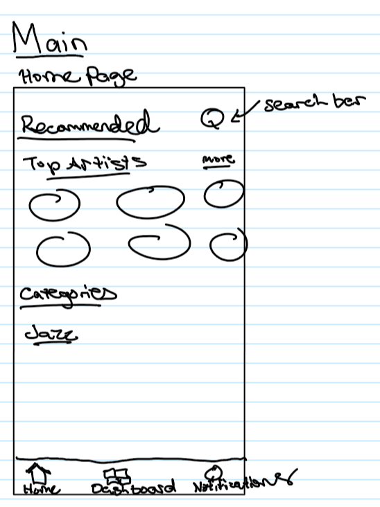
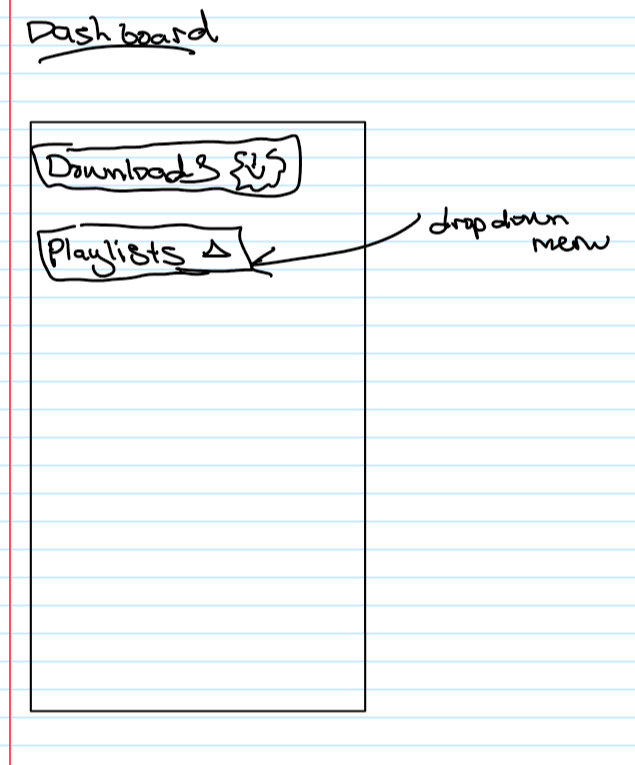

App Description:

In this cloud computing activity, I have decided to make a music player app. This app is not yet finish and I will continue to be working on it through out my education. Opening the app will first navigate to the homepage. The homepage will include the recommendations, a search button and three buttons at the bottom (Home, Dashboard, and Now Playing). Currently the Now Playing button is the only functionality. Pressing the Now Playing button will result in a preloaded song that can be played and paused and manipulate the song position using the slider. 

Future Endeavors:

There are many functionalities I still need to implement in my music player.
0) Complete Now Playing Page; Back Button, Next Music, Previous Music, Drop Down Menu of list of music, song title, song picture, etc. 
1) Search Function that opens youtube to search for a song and there is an option to download the song using youtube converter API's if they exist.
2) Recommendations - High hopes of implementing machine learning to reflect the user's interest.
3) DashBoard includes Downloads and Playlists Buttons. Pressing Downloads button shows all the downloaded songs. Pressing the Playlists button shows all the different playlists, and pressing any playlist will show the songs in that playlists. Pressing any song will result in going to the Now Playing Page showing the song playing. 
4) The Home Button is there to go back to the homepage.

Design:

Reflection:

This is my first time learning about app development and I really enjoyed the process. However, I still consider myself as an absolute beginner and there are still lots of learning to come. I will pursue learning more about app development using Android Studio, even IOS apps using Swift. I hope that I am given the opportunity to be part of Reach Project90 because I think it will give me the opportunity to practice and enhance my skills in app development and machine learning in Azure. 